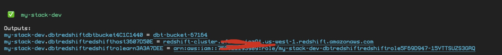
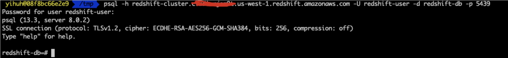

这是Blog [另辟蹊径: 在云端使用SQL语言实现数据转化，测试和文档维护]() 的代码仓库。


## 创建Redshift集群

使用如下命令创建Redshift 测试集群：

``` shell
git clone https://github.com/readybuilderone/elt-with-dbt-demo.git
cd elt-with-dbt-demo
npx projen
npx cdk bootstrap
npx cdk deploy --profile <YOUR-PROFILE>
```

注意，请将上述代码中的 <YOUR-PROFILE> 替换为您配置的AWS Credential的Profile。

执行完成之后，会创建一具有公网访问权限的S3 Bucket 和 一个Redshift集群。

创建成功后，会在命令行打印出：

- 用于存放需要加载到Redshift数据的S3的BucketName；
- Redshift的Host地址；
- Redshift的Execute Role的ARN




Redshift的链接信息如下

- Redshift DB Name: redshift-db

- Redshift User: redshift-user

- Redshift Port: 5439

- Redshift Host: 参考CDK运行截图

  

  

上述CDK 代码会在Secrets Manager中创建 名为"redshift-credentials" 的secrets，您可以通过Retrieve secret value 查看。


可以使用如下命令，测试Redshift连接 (参考: https://docs.aws.amazon.com/redshift/latest/mgmt/connecting-from-psql.html): 

``` shell
psql -h <endpoint> -U <userid> -d <databasename> -p <port>
```



